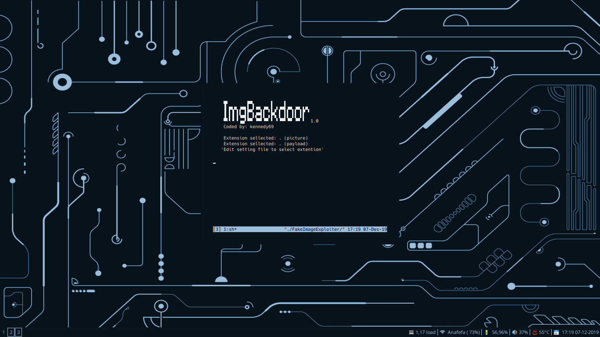

 

     _____                 ____             _       _                  
    |_   _|               |  _ \           | |     | |                 
      | |  _ __ ___   __ _| |_) | __ _  ___| | ____| | ___   ___  _ __ 
      | | | '_ ` _ \ / _` |  _ < / _` |/ __| |/ / _` |/ _ \ / _ \| '__|
     _| |_| | | | | | (_| | |_) | (_| | (__|   < (_| | (_) | (_) | |   
    |_____|_| |_| |_|\__, |____/ \__,_|\___|_|\_\__,_|\___/ \___/|_|   
                      __/ |                                            
                     |___/                                               

    Version release: v1.0 (Stable)
    Author: Ferdi S Kennedy [ kennedy69 ]
    Distros Supported : Linux Ubuntu, Kali, Mint, Parrot OS

## Legal Disclamer:
    The author does not hold any responsibility for the bad use of this tool,
    remember that attacking targets without prior consent is illegal and punished by law.

  

## Description:
    This module takes one existing image.jpg and one payload.ps1 (input by user) and
    builds a new payload (agent.jpg.exe) that if executed it will trigger the download of
    the 2 previous files stored into apache2 (image.jpg + payload.ps1) and execute them.

    This module also changes the agent.exe Icon to match one file.jpg Then uses the spoof
    'Hide extensions for known file types' method to hidde the agent.exe extension.

    All payloads (user input) will be downloaded from our apache2 webserver
    and executed into target RAM. The only extension (payload input by user)
    that requires to write payload to disk are .exe binaries.
 
## Exploitation:
    ImgBackdoor stores all files in apache2 webroot, zips (.zip) the agent,
    starts apache2 and metasploit services(handler), and provides a URL to send to
    target (triggers agent.zip download). As soon as the victim runs our executable,
    our picture will be downloaded and opened in the default picture viewer, our
    malicious payload will be executed, and we will get a meterpreter session.

    But it also stores the agent (not ziped) into ImgBackdoor/output folder
    if we wish to deliver agent.jpg.exe using another diferent attack vector.

    'This tool also builds a cleaner.rc file to delete payloads left in target'

## Payloads accepted (user input):
    payload.ps1 (default) | payload.bat | payload.txt | payload.exe [Metasploit]
    "Edit 'settings' file before runing tool to use other extensions"

## Pictures accepted (user input):
    All pictures with .jpg (default) | .jpeg | .png  extensions (all sizes)
    "Edit 'settings' file before runing tool to use other extensions"

  

## Dependencies/Limitations:
    xterm, zenity, apache2, mingw32[64], ResourceHacker(wine)
    'Auto-Installs ResourceHacker.exe under ../.wine/Program Files/.. directorys'

    WARNING: To change icon manually (resource hacker bypass) edit 'settings' file.
    WARNING: Only under windows systems the 2º extension will be hidden (so zip it) 
    WARNING: The agent.jpg.exe requires the inputed files to be in apache2 (local lan hack)
    WARNING: The agent.jpg.exe uses the powershell interpreter (does not work againts wine).
    WARNING: This tool will not accept payload (user input) arguments (eg nc.exe -lvp 127.0.0.1 555)
    WARNING: The ResourceHacker provided by this tool requires WINE to be set to windows 7

  

## Another senarios:
    If you wish to use your own binary (user input - not metasploit payloads) then:
1 - Edit 'settings' file before runing tool and select 'NON_MSF_PAYLOADS=YES'
2 - Select the binary extension to use
**'Remmenber to save settings file before continue'** ..

3 - Run ImgBackdoor to metamorphosis your binary (auto-storage all files in apache) ..
4 - Open new terminal and execute your binary handler to recibe connection.
**HINT: This funtion will NOT build a cleaner.rc**

  

## The noob friendly funtion:
    Bypass the need to input your payload.ps1, And let ImgBackdoor take
    care of building the required payload.ps1 + agent.jpg.exe and config the handler.
    "With this funtion active, you only need to input your picture.jpg :D"
    Select the binary extension to use
**HINT: This funtion allow users to build (ps1|bat|txt) payloads** 
**HINT: This funtion will NOT build .exe binaries**

  

## "WINE is not owned by you":
    If you get this message it means that you are executing ImgBackdoor
    as sudo and your wine installation belongs to user (is not owned by you) to
    bypass this issue just execute ImgBackdoor as the wine owner.
    EXAMPLE: If wine its owned by spirited_wolf, execute tool without sudo
    EXAMPLE: If wine its owned by root, execute tool as sudo

  

## Download/Install/Config:
    1 - Download framework from github
         git clone https://github.com/Tsuyoken/ImgBackdoor

    2 - Set files execution permitions
         cd ImgBackdoor
         sudo chmod +x *.sh

    3 - Config ImgBackdoor settings
         nano settings

    4 - Run main tool
         sudo ./ImgBackdoor

#### WARNING: set Resource-Hacker.exe installer to 'Program Files' (not Program Files (x86))
